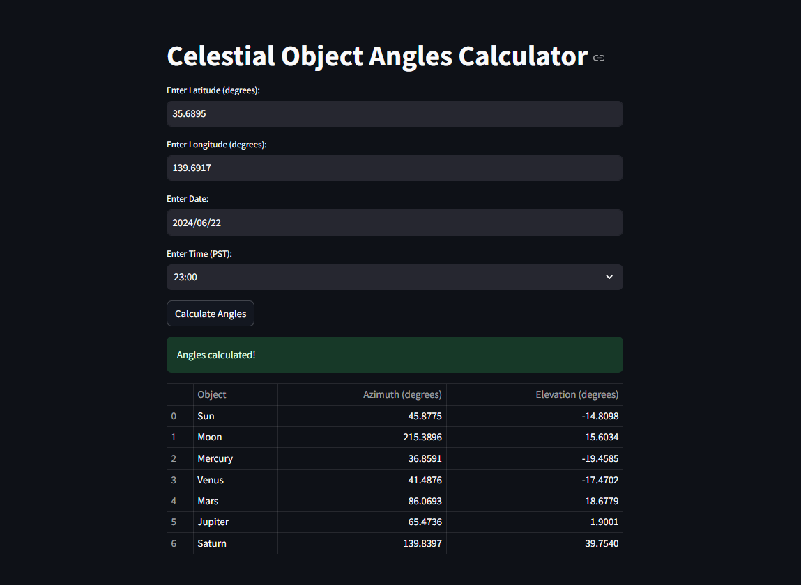

# Celestial Object Angles Calculator



## Overview

The Celestial Object Angles Calculator is a user-friendly web application built with Streamlit that calculates and displays the azimuth and elevation angles of various celestial objects, such as the Sun, Moon, and planets, based on a specified location (latitude and longitude) and time. This tool is particularly useful for astronomers, educators, and enthusiasts interested in understanding the positions of celestial bodies in the sky.

## Features

- **Interactive User Interface**: Easy-to-use input fields for latitude, longitude, date, and time.
- **Real-Time Calculations**: Computes azimuth and elevation angles for multiple celestial objects.
- **Data Presentation**: Displays results in a clear and organized table format.

## Installation

1. **Clone the Repository**:
   ```sh
   git clone https://github.com/your-username/celestial-angles-calculator.git
   cd celestial-angles-calculator
   
2. **Install Required Packages:**
  ```sh
  Copy code
  pip install -r requirements.txt
  ```

## Usage
1. **Run the Streamlit App:**
```sh
streamlit run app.py
Enter Input Values:
```
2. **Input Values:**
- Latitude (degrees)
- Longitude (degrees)
- Date
- Time (PST)

3. **Calculate Angles:**
Click the `Calculate Angles` button to compute and display the azimuth and elevation angles of the selected celestial objects.

## Project Structure
- `app.py`: The main application file containing the Streamlit code and the celestial angle calculations.
- `requirements.txt`: A list of required Python packages.
  
## Dependencies
- `streamlit`
- `ephem`
- `pytz`
- `pandas`
- `Screenshot`

## Contributing
Contributions are welcome! Please feel free to submit a Pull Request.
